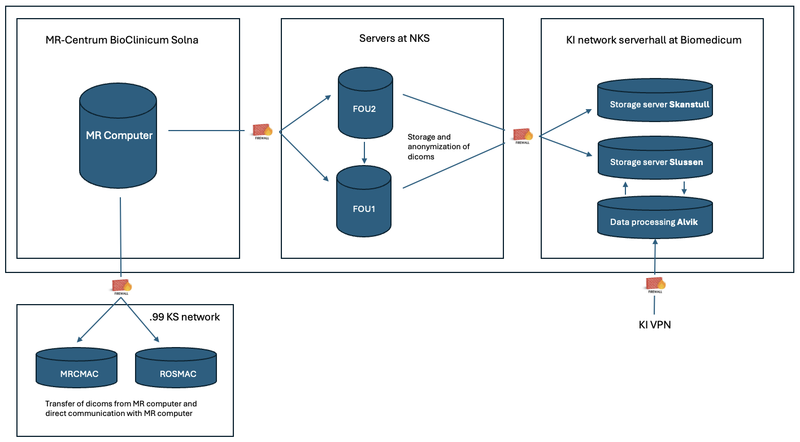

# Main information

### Server architecture

The primary server to be aware of is **Alvik**, the computational server with access to the storage server (where your data is located).

<figure><figcaption></figcaption></figure>

### Data organization

* DICOM files are stored under the directory **/data/dicom**
* Each **study** is **stored** under a **specific directory** whose name is a concatenation of the _examination number_, _the date_, and _the time_. \
  E.g. study 38456 performed on July1st 2022 at 13:01:20 will be stored under: <mark style="color:purple;">/data/dicom/38456\_20220701\_130120/</mark>
* Inside that directory, one can find all the sequences that have been run.&#x20;
* Most often directory <mark style="color:blue;">**00000001**</mark> contains the <mark style="color:blue;">**localizer**</mark>, <mark style="color:green;">**00000002**</mark> a <mark style="color:green;">**calibration**</mark>. The rest of the **directories**, **00000003**, **00000004** etc, can include structural T1, fMRI, DTI images. fMRI and DTI sequences generate several thousand DICOM files inside a directory.
* Every morning at 1:00 a.m., any **DICOMs** that have not yet been transferred from fou2 are **automatically copied**.
